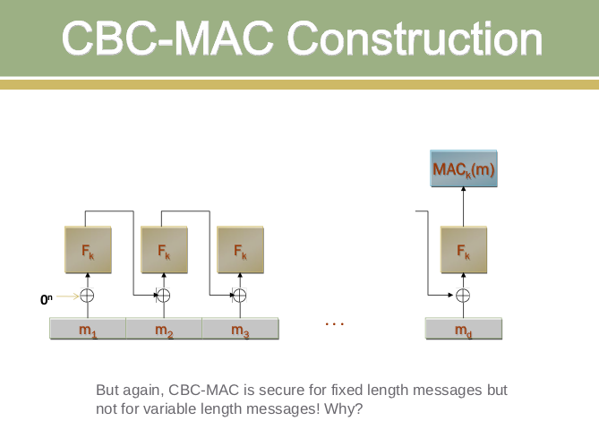

For a very brief introduction to message authentication codes and secure CBC-MAC, click [here](docs/Message-Authentication-Codes.pdf)

The Cipher Block Chaining Message Authentication Code (CBC-MAC) is a widely used method for providing message authentication and data integrity. It uses a block cipher in CBC mode to generate a fixed-length authentication tag for messages of arbitrary length.

### How CBC-MAC Works

1. **Block Division**: The message is divided into blocks of fixed size (typically 128 bits)
2. **Initialization**: Start with an Initialization Vector (IV), usually set to zero
3. **Chaining**: Each block is XORed with the output of the previous encryption
4. **Final Tag**: The final encrypted block serves as the authentication tag

### Mathematical Representation

For a message M = M₁ || M₂ || ... || Mₙ divided into blocks:

- **First Block**: C₁ = E_k(M₁ ⊕ IV)
- **Subsequent Blocks**: Cᵢ = E_k(Mᵢ ⊕ Cᵢ₋₁)
- **MAC Tag**: MAC = Cₙ (the final encrypted block)

Where:

- E_k is the encryption function with key k
- ⊕ represents the XOR operation
- || represents concatenation

### Security Considerations

Basic CBC-MAC has several important security requirements:

1. **Fixed Message Length**: Secure only for messages of predetermined, fixed length
2. **Length Extension Vulnerability**: Vulnerable to attacks when used with variable-length messages
3. **Key Management**: Requires careful key management and distribution

### Secure CBC-MAC Constructions

To address security vulnerabilities, several secure variants exist:

1. **Length-Prefixed CBC-MAC**: Prepend message length to prevent extension attacks
2. **Two-Key CBC-MAC**: Use different keys for intermediate and final operations
3. **CMAC (OMAC)**: NIST-approved secure variant using key derivation

### Applications and Use Cases

CBC-MAC is commonly used in:

1. **Financial Systems**: Banking and payment card industry standards
2. **Network Protocols**: Authentication in secure communication protocols
3. **Data Storage**: Ensuring integrity of stored data
4. **Embedded Systems**: Lightweight authentication in resource-constrained environments

### Comparison with Other MACs

| Feature          | CBC-MAC      | HMAC          | CMAC         |
| ---------------- | ------------ | ------------- | ------------ |
| Base Primitive   | Block Cipher | Hash Function | Block Cipher |
| Security         | Conditional  | Unconditional | Proven       |
| Efficiency       | High         | Medium        | High         |
| Key Requirements | Single Key   | Single Key    | Derived Keys |

### Practical Implementation

The simulation demonstrates:

1. **Step-by-step computation** of CBC-MAC values
2. **Function testing** with various input patterns
3. **Security analysis** of different constructions
4. **Real-world scenarios** with padding and key management
